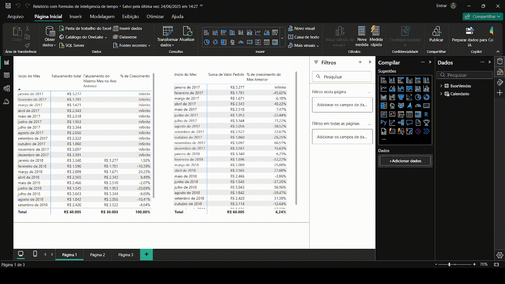

# 📊 Portfólio Power BI – André Júnior

Bem-vindo ao meu portfólio de dashboards desenvolvidos em Power BI. Aqui apresento projetos com foco em visualização de dados, tomada de decisão, modelagem e performance analítica. Os relatórios utilizam recursos como DAX, Power Query (ETL), filtros interativos e storytelling visual. Embora este portfólio não contenha todos os dashboards que já desenvolvi, ele representa bem a aplicação prática dos meus conhecimentos.

📁 [Acesse os arquivos no Google Drive](https://drive.google.com/drive/folders/1I1Q_jQBBlATVh3GNoBiGCiLd3EGT32hE?usp=sharing)

---

## 🧠 Habilidades Utilizadas
- Modelagem de dados e relacionamento
- ETL com Power Query
- Criação de medidas e colunas DAX
- Dashboards interativos com foco em performance
- Inteligência de tempo
- Design limpo e responsivo

---

## 🗂️ Projetos

### 1. Dashboard de Vendas

**Resumo:**  
- Análise de faturamento e quantidade vendida por mês  
- Destaques como faturamento total e produto mais vendido  
- Faturamento por marca  
- Mapa com faturamento por continente  
- Visualizações focadas em performance global

---

### 2. Dashboard de Produção

**Resumo:**  
- Acompanhamento mensal do total aprovado e rejeitado  
- Indicadores de produtividade, qualidade, horas produtivas e paradas  
- Gráfico de tendência de produção  
- Visão gerencial e operacional com segmentações por operador e mês

---

### 3. Dashboard de RH

**Resumo:**  
- Indicadores de contratações, ativos, desligamentos e turnover  
- Funcionários ativos por cidade e gênero  
- Mapa de hierarquia entre áreas e cargos  
- Visual moderno com foco em análise de equipe

---

### 4. Dashboard Financeiro

**Resumo:**  
- Indicadores financeiros principais: receita, despesa, imposto e lucro  
- Análise de margem e forma de pagamento  
- Gráfico de lucro por mês (tipo cascata)  
- Visualizações adicionais com insights sobre o desvio da meta

---

### 5. Dashboard de Gestão de Vendas

**Resumo:**  
- Acompanhamento por loja, forma de pagamento e período  
- Indicadores de faturamento, comissão e ticket médio  
- Análise de vendas por produto com destaque percentual  
- Filtros superiores com interatividade por categoria de produto

---

### 6. Dashboard com Inteligência de Tempo

**Resumo:**  
- Aplicação de fórmulas DAX avançadas: YTD (Ano até a data), MTD (Mês até a data), LY (Ano anterior)  
- Ideal para comparativos de desempenho por períodos  
- Ferramenta útil para gestores acompanharem evolução sazonal

---

## 📫 Contato

- 📧 Email: andrejunior.pessoal@gmail.com  
- 💼 LinkedIn: [https://www.linkedin.com/in/andre-jnr/](https://www.linkedin.com/in/andre-jnr/)
